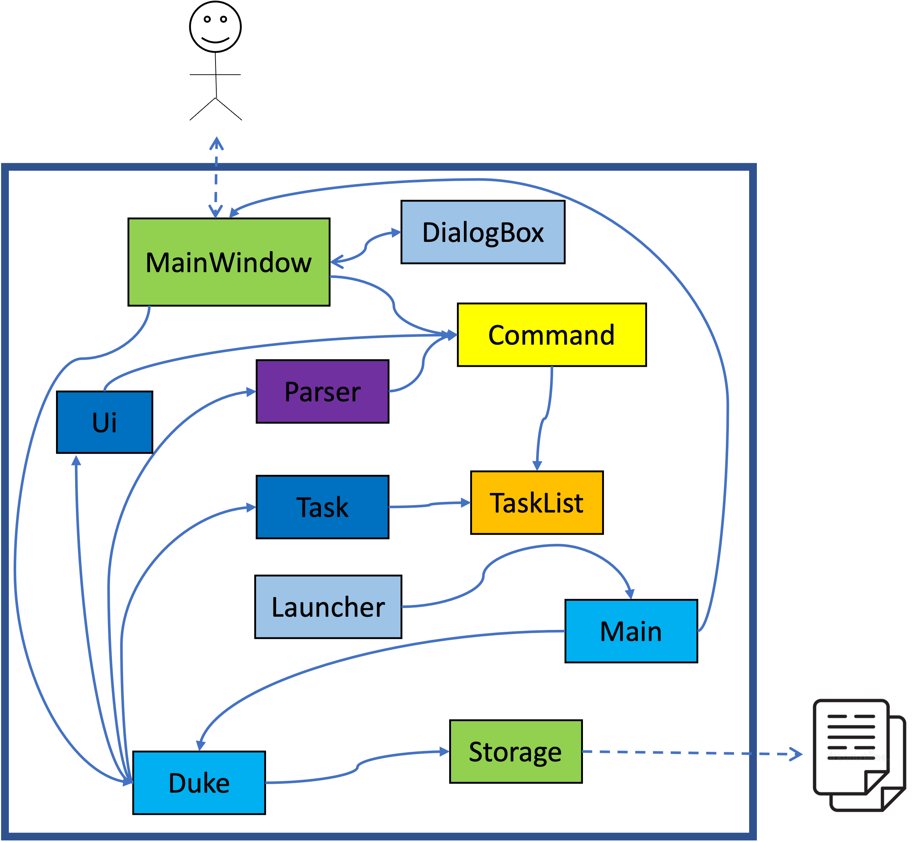
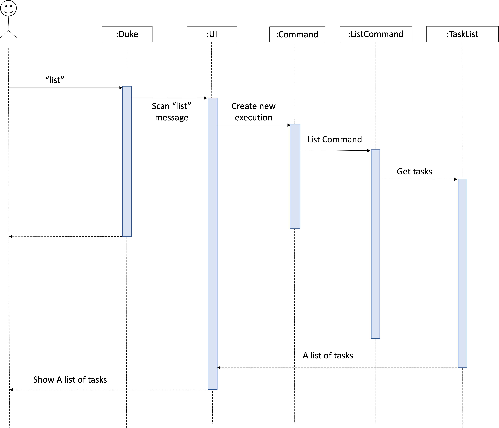

# Developer Guide

* *[Acknowledgements](DeveloperGuide.md#acknowledgements)*
* *[Setting up, getting started](DeveloperGuide.md#setting-up-getting-started)*
* *[Design](DeveloperGuide.md#design)*
* *[Implementation](DeveloperGuide.md#implementation-sequence-diagram)*
* *[Documentation, testing](DeveloperGuide.md#documentation-logging-testing)*
* *[Appendix: Requirements](DeveloperGuide.md#appendix-requirements)*
* *[Use Cases](DeveloperGuide.md#use-cases)*

## Acknowledgements

* Thanks to Prof Damith C.Rajapakse and Boyd Anderson provide consulation for my ip.

## Setting up, getting started
**Refer to the guide** <a href="https://github.com/e0373972/ip/blob/master/docs/UserGuide.md">Setting up and getting started.</a>

## Design

* *Architecture* <br/>
   <br/>
* *UI component* (MainWindow, Launcher, Input/ Output)
* *Logic component* (Command, Parser)
* *Model component* (Task, TaskList)
* *Storage component* (Storage)
  API: <a href="https://github.com/e0373972/ip/blob/master/src/main/java/seedu/duke/Storage.java">Storage.java</a>   
  <br> The Storage component,
  <br> a. can save tasks.txt file to `/data` folder and load the tasks.txt file back `/data` folder with corresponding format.
  <br> b. auto save when user execute delete and add tasks command    
  <br>    `File format` showing as below,

            Here are the tasks in your list:
            1.[D][X]return book (by:Dec 2 2021 1800) 
            2.[E][X]project meeting (at:Dec 2 2021 1700) 

* *Common classes* (TaskList)

1. ```Class diagram (refer to the image below)```<br/>
    
2. ```Object diagram```<br/>
    

## Implementation (Sequence Diagram)

* List Command <br>
  The user execute `list` command to show all the items in the list.<br/>
  UI scanned `list` command from user, `Command` create a new `ListCommand` and `run()` to get the tasks from Arraylist, taskList return the tasks to UI and show to user. <br/>

 <br/>

## Documentation, testing
* **Testing Guide**
  <br> There are two ways to run tests:

  1. Using **IntelliJ JUnit test runner**. Run all tests, right-click on the `src/test/java` folder </br>
     a. choose `Run` 'All Tests' </br>
     b. Run a subset of tests, you can right-click on a test package, test class and select `Run` 'ParserTest' </br>
  2. Using **Gradle**
     Open a console and run the command gradlew clean test (Mac/Linux: ./gradlew clean test)
  

## Appendix: Requirements

### Product scope

**Target user profile**

* has a need to manage and track daily tasks
* prefers desktop apps over other types
* prefers typing to mouse interactions
* is reasonably comfortable using CLI apps

**Value proposition**

* keep record of tasks
* track daily tasks easily
* avoid missing some important tasks

### User Stories

| As a/an ...              | I want to ...                                                                   | So that I can ...|
|--------------------------|---------------------------------------------------------------------------------|------------------|
| engineer                 | add different types of tasks, marking/unmarking tasks as done, and delete tasks |keep track of various things|
| project manager          | list down all the tasks                                                         |manage the overall project|
| personal assistant       | find a specific task, and view schedule                                         |server my boss well|
| document control officer | back up the task list file to another hard disk                                 |assign the revision to the file|
| student                  | add the deadline of the homework                                                |manage to submit the homework before the deadline|

### Use Cases

(For all use cases below, the **System** is ```TASKS MANAGEMENT SYSTEM (TMS)``` and the **Actor** is the ```user```, unless specified otherwise)

**Use case: Add Todo Task**
1. User keys in todo task details
2. TMS records the todo task
3. TMS shows the todo task added successfully
4. Data files updated automatically

**Use case: Add Deadline Task**
1. User keys in deadline details
2. TMS records the deadline task
3. TMS shows the deadline task added successfully
4. Data files updated automatically

**Use case: Add Event Task**
1. User keys in event details
2. TMS records the event task
3. TMS shows the event task added successfully
4. Data files updated automatically

**Use case: List Tasks**
1. User requests to view tasks
2. TMS shows the list of tasks

**Use case: View Schedules**
1. User keys in the specific date to search
2. TMS performs searching
3. TMS displays the result

**Use case: Delete Task**
1. User requests to delete a specific task
2. TMS deletes the task from the list
3. TMS shows the task deleted successfully
4. Data files updated automatically

**Use case: Find Task**
1. User keys in the keyword to search
2. TMS performs searching
3. TMS displays the result

**Use case: Bye**
1. User requests to exit the program
2. TMS terminates safely

### Non-Functional Requirements

* Should work on any mainstream OS as long as it has Java 11 or above installed.
* Should be able to hold up to 1000 tasks without a noticeable sluggishness in performance.
* The system reacts to the given input is within a few seconds.
* The system allows developers to add in more functions or extent the function through modification of exiting functionality.
* The command should be simple enough so that users are able to accomplish most of the tasks faster using typing than using the mouse.
* Should be easy for new users to get used to usage fast.

### Glossary

**Mainstream OS**:  Windows, Linux, Unix, OS-X
