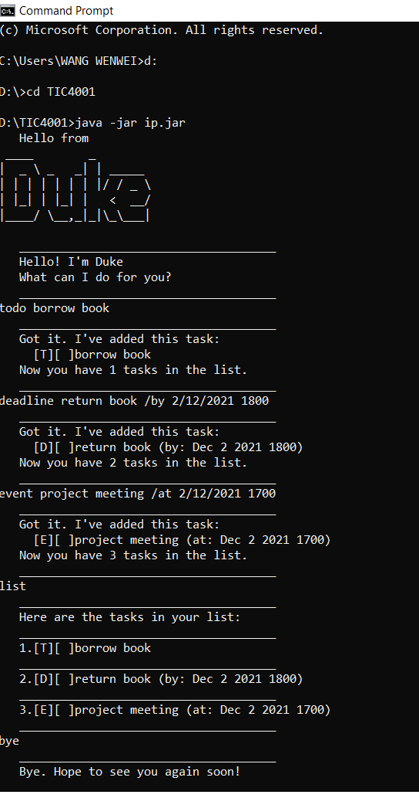

# User Guide

DukePro is a **desktop app for managing tasks, optimized for use via a Command Line Interface (CLI)**.

## Quick Start
1. Ensure you have Java ```11 ``` or above installed in your computer.
1. Download the latest ```ip.jar ``` from [here](https://github.com/e0373972/ip/releases).
1. Copy the file to the folder you want to use as the home folder for your DukePro.
1. Create an empty folder name  ```data ``` (refer to the image below).<br/>
   
1. Open Command Prompt and type ```java -jar ip.jar``` to start the app.<br/>
   
1. Type the command in the command box and press Enter to execute it.<br/>
   Some example commands you can try:
* ```todo borrow book ```: Add todo task ```borrow book ``` to the task list.
* ```event project meeting /at 2/12/2021 1700 ```: Add event  ```project meeting (at Dec 2 2021 1700) ``` to the task list.
* ```deadline return book /by 2/12/2021 1800 ```: Add deadline ```return book (by Dec 2 2021 1800) ``` to the task list.
* ```list ```: List all tasks.
* ```done 2 ```: Mark the 2nd task as done.
* ```delete 2 ```: Delete the 2nd task in the list.
* ```find book ```: Search the task with keyword of ```book```.
* ```bye ```: Exits the app.

## Features 

### Add todo: ```todo ```

Adds a todo task to the DukePro task list.

Format: ```todo DESCRIPTION```
* The ```DESCRIPTION``` is the detail of the task.
* The ```DESCRIPTION``` cannot be empty.

Example: 
* ```todo borrow book ```

### Adding an event: ```event ```

Adds an event to the DukePro task list.

Format: ```event DESCRIPTION /at date/month/year time ```
* The ```DESCRIPTION``` is the detail of the event.
* Use ```/at ``` between ```DESCRIPTION``` and ```datetime ```
* The ```DESCRIPTION``` and ```date/month/year time ``` cannot be empty.

Example: 
* ```event project meeting /at 2/12/2021 1700 ```

### Adding a deadline: ```deadline ```

Adds a deadline to the DukePro task list.

Format: ```deadline DESCRIPTION /by date/month/year time ```
* The ```DESCRIPTION``` is the detail of the deadline.
* Use ```/by ``` between ```DESCRIPTION``` and ```datetime ```
* The ```DESCRIPTION``` and ```date/month/year time ``` cannot be empty.

Example: 
* ```deadline return book /by 2/12/2021 1800 ```

### Show tasks: ```list ```

To show all the tasks in the list.

Format: ```list ```

Example: 
* ```list ```

### Mark as done: ```done ```

To mark a task as done.

Format: ```done INDEX ```
* Mark the task as done at the specified ```INDEX ```. The index refers to the index number shown in the displayed task list.
* The index **must be a positive integer** 1, 2, 3, ...
* The index cannot be empty.

Example: 
* ```done 2 ```

### Delete a task: ```delete ```

To delete a task in the list.

Format: ```delete INDEX ```
* Delete the task at the specified ```INDEX ```. The index refers to the index number shown in the displayed task list.
* The index **must be a positive integer** 1, 2, 3, ...
* The index cannot be empty.

Example: 
* ```delete 2 ```

### Search tasks: ```find ```

Search the task with the keyword.

Format: ```find KEYWORD ```
* The ```KEYWORD``` is the keyword to search.
* The ```KEYWORD``` cannot be empty.

Example: 
* ```find book ```

### Exiting the program: ```bye ```

Exits the program.

Format: ```bye ```

Example: 
* ```bye ```

## FAQ

**Q**: How do I transfer my data to another Computer?

**A**: Without running the program, just copy the ```tasks.txt``` in the ```data``` folder.
To run and show the data in another computer, you need to follow the ```Quick Start``` above, and copy the ```tasks.txt``` to the ```data``` folder. 

## Command Summary

**Action** | **Format, Examples**
------------ | -------------
**Todo** | ```todo DESCRIPTION``` e.g.,```todo borrow book ```
**Event** | ```event DESCRIPTION /at date/month/year time ``` e.g., ```event project meeting /at 2/12/2021 1700 ```
**Deadline** | ```deadline DESCRIPTION /by date/month/year time ``` e.g., ```deadline return book /by 2/12/2021 1800 ```
**List** | ```list ``` e.g., ```list ```
**Done** | ```done INDEX ``` e.g., ```done 2 ```
**Delete** | ```delete INDEX ``` e.g., ```delete 2 ```
**Find** | ```find KEYWORD ``` e.g., ```find book ```
**Bye** | ```bye ``` e.g., ```bye ```


